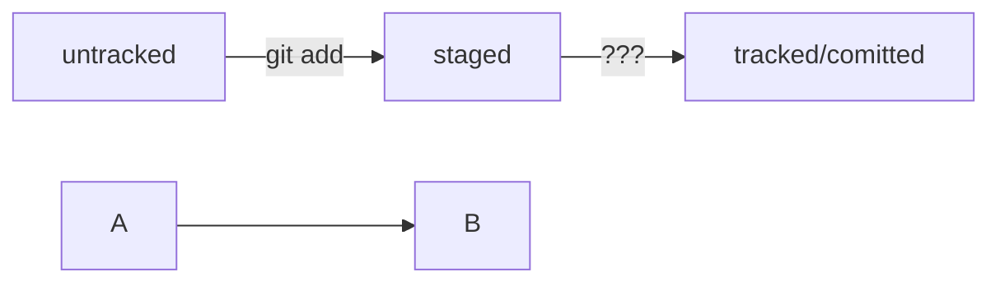

Хеш — идентификатор коммита
Сокращённый лог вызывают командой git log с флагом --oneline
HEAD — всему голова

```mermaid
graph LR;
  untracked -- "git add" --> staged;
  staged    -- "???"     --> tracked/comitted;

%% стрелка без текста для примера: 
  A --> B;
``` 